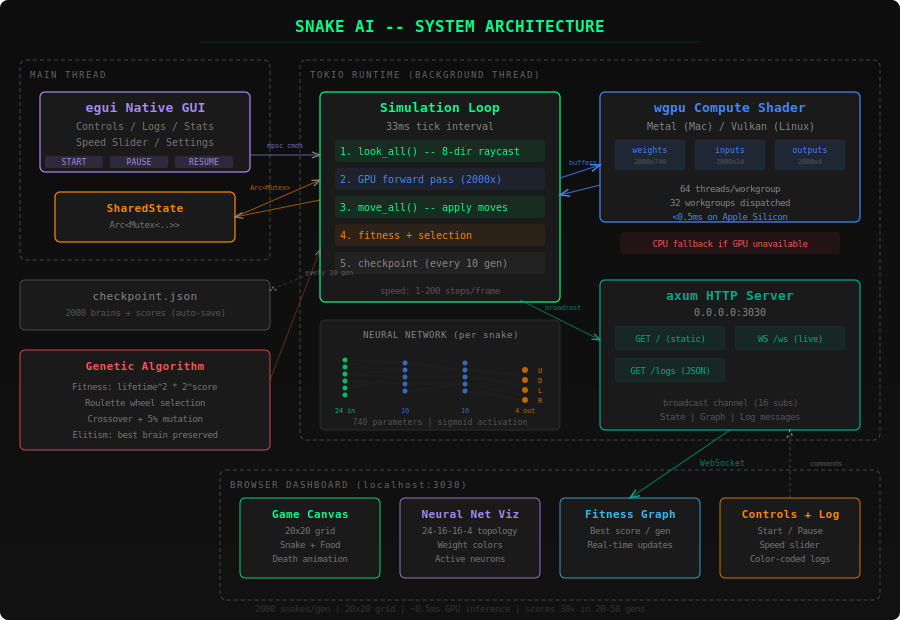

# Snake AI

[](https://www.rust-lang.org/)
[](https://wgpu.rs/)
[](LICENSE)
[]()

A neuroevolutionary system that trains neural networks to play Snake using a genetic algorithm, with GPU-accelerated inference via **wgpu** compute shaders.

The Rust backend runs the simulation and serves a browser-based dashboard over WebSocket. A native **egui** GUI provides a control panel with live logs. The frontend is embedded in the binary -- no external files needed.

## Architecture

<p align="center">
  
</p>

## Features

- **GPU compute** -- all 2000 neural network forward passes run in parallel via wgpu (Metal on Mac, Vulkan on Linux)
- **CPU fallback** -- automatically detects when GPU is unavailable (Docker, Windows, etc.)
- **Stages** -- Classic (empty grid), Warehouse (obstacle racks with AMR robot visuals), Mixed (randomized per generation)
- **Browser dashboard** -- real-time game view, neural network visualization, fitness graph, hardware monitor, and color-coded log panel
- **Native GUI** -- egui control panel with stats, stage selector, and log terminal
- **Auto-checkpoint** -- saves progress every 10 generations to `checkpoint.json`, resumes on restart
- **Embedded frontend** -- `index.html` baked into the binary, works when double-clicking from anywhere
- **Paper included** -- `paper.pdf` with full algorithm description

## Stages

| Stage | Description |
|-------|-------------|
| **Classic** | Empty 20x20 grid. The default. Scores reach 50+ within 500 generations. |
| **Warehouse** | Two horizontal rack obstacles. Cartoon top-down warehouse floor with yellow safety lines, AMR robot head with lidar dome, trailing cargo carts. Food appears as cardboard packages. |
| **Mixed** | Randomly alternates between Classic and Warehouse each generation. Trains a single brain that generalizes across all stages. |

Switching stages preserves trained brains -- no progress is lost.

## Algorithm

| Component | Detail |
|-----------|--------|
| Population | 2000 snakes |
| Network | 24 inputs, 2 hidden layers (16 neurons each, sigmoid), 4 outputs |
| Vision | 8-direction raycasting (food, body/obstacle, wall distance) |
| Fitness | `lifetime * 2^min(score,10) * max(score-9, 1)` |
| Selection | Fitness-proportionate (roulette wheel) |
| Crossover | Single cut-point per weight matrix |
| Mutation | 8% Gaussian perturbation (std ~0.25, clamped to [-2, 2]) |
| Elitism | Best brain preserved across generations |

## Quick Start

### One-liner (auto-detects Rust or Docker)

```bash
git clone https://github.com/jonpol01/snake-ai.git
cd snake-ai
./run.sh
```

The script will:
1. Use the pre-built binary if it exists
2. Otherwise build from source if Rust is installed
3. Otherwise use Docker if available
4. Tell you what to install if neither is found

Then open **http://localhost:3030** in your browser and click **Start**.

### Native (macOS / Linux)

```bash
# Clone and build
git clone https://github.com/jonpol01/snake-ai.git
cd snake-ai
cargo build --release

# Run (opens native GUI + starts web server)
cargo run --release

# Open browser dashboard
open http://localhost:3030
```

Click **Start** from either the GUI or the browser to begin evolution.

### Docker (any platform -- Windows, Linux, macOS)

No Rust toolchain needed. GPU is not available inside Docker, so it uses the CPU fallback (still fast, just ~2-5x slower than GPU).

```bash
# Clone
git clone https://github.com/jonpol01/snake-ai.git
cd snake-ai

# Build and run
docker compose up --build

# Open browser dashboard
# http://localhost:3030
```

Or build manually:

```bash
docker build -t snake-ai .
docker run -p 3030:3030 snake-ai
```

The native egui GUI won't display inside Docker -- use the browser dashboard at `http://localhost:3030` for full control (start, pause, speed, stage selection).

> **Windows users**: This is the easiest way to run it. Install [Docker Desktop](https://www.docker.com/products/docker-desktop/), clone the repo, and `docker compose up --build`. No Rust, no GPU drivers, just a browser.

## Requirements

### Native
- Rust 1.85+
- macOS with Apple Silicon (Metal) or Linux with Vulkan-capable GPU
- A modern browser (Chrome, Safari, Firefox, Edge)

### Docker
- Docker and Docker Compose
- Any OS (Windows, macOS, Linux)
- A modern browser

## Project Structure

```
src/
  main.rs          -- axum server, sim loop, WebSocket handler
  gui.rs           -- egui native window
  gpu.rs           -- wgpu compute shader + CPU fallback
  neural_net.rs    -- Matrix, NeuralNet (crossover, Gaussian mutation)
  snake.rs         -- Snake game logic, 8-direction vision
  population.rs    -- Genetic algorithm, checkpointing
  stage.rs         -- Stage system (Classic, Warehouse, Mixed)
  protocol.rs      -- WebSocket message types
  shared.rs        -- SharedState for GUI <-> sim communication
static/
  index.html       -- Browser dashboard (embedded into binary at compile time)
docs/
  architecture.svg -- System architecture diagram
```

## How It Works

1. **2000 snakes** spawn on the grid, each with a random neural network (740 weights)
2. Each snake **sees** in 8 directions via raycasting (food, body/obstacles, wall distance = 24 inputs)
3. The GPU runs all 2000 forward passes **in parallel** via a wgpu compute shader
4. Each snake picks a direction (up/down/left/right) based on its network output
5. When all snakes die, **fitness** is calculated: `lifetime * 2^score`
6. **Natural selection**: parents chosen by roulette wheel, offspring via crossover + Gaussian mutation
7. The **best brain** is preserved (elitism) -- it never gets worse
8. Repeat. Scores typically reach 50+ within 500 generations

## License

MIT
